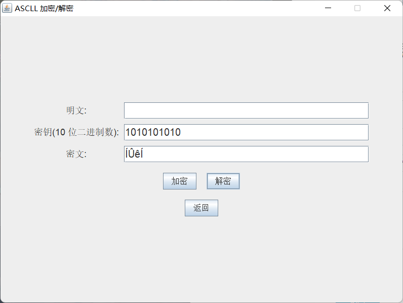

# 项目大致情况

该项目全程使用 **java+swing**规范代码实现，要求jdk 1.8及以上环境。内容包括简易版DES算法（S-DES）的原理实现（包括给定明文密钥的加密过程、给定密文密钥的解密过程、给定明文密文的密钥破解过程）、界面设计、多线程的应用等。

## 过关斩将
### 第一关 基本测试
欢迎界面<br>
#### 包含项目标题以及三个分页面的按键入口，点击按钮即可进入相应界面
<br>

加密/解密界面<br>
#### 包含有八位明文框、十位密钥框、八位密文框。
<br>

#### 键入八位明文，十位密钥时，点击加密按钮，即可生成对应密文


#### 键入八位密文，十位密钥时，点击解密按钮，即可生成对应明文


#### 当任意框内键入位数不正确或出现非二进制数时，报错


### 第二关 交叉测试
#### 使用的测试对：明文00100100；密钥1101101101
<br>我们组的明文加密结果<br>

<br>验证组的明文加密结果<br>

<br>可以看到加密结果是一致的<br>

### 第三关 扩展功能
#### 可用于加密ascll码，以字符串 "test"为例，如图<br>
<br>
#### 解密时同理<br>
<br>

### 第四关 暴力破解
#### 对于一个明密文对，使用暴力破解的方式获得密钥，这里使用了多线程的方式，将在后续代码部分提到<br>
<br>

### 第五关 封闭测试
#### 由第四关可知，对于同一个明密文对，密钥可能不止一把。即存在对于同一个明文，不同的密钥加密得到的密文相同的情况

# 开发手册
1 算法简介<br>
&nbsp;&nbsp;&nbsp;&nbsp;&nbsp;&nbsp;&nbsp;&nbsp;S-DES是一种经典的分组密码算法，用于对8bits明文数据进行加密和解密。它主要包括两个阶段：密钥生成和数据加密/解密。S-DES算法是一种基础的加密算法，可以用于教育和学术目的，但不适合用于安全要求较高的应用。在实际应用中，通常会使用更强大的加密算法，如AES（Advanced Encryption Standard）。<br>
* 密钥生成<br>
    * 用户提供一个10bits的密钥（K1 K2 K3 K4 K5 K6 K7 K8 K9 K10）<br>
    * 密钥产生两个8bits的子密钥：K1和K2
* 数据加密
    * 明文被分为两个4bits的块：L0和R0
    * 对L0和R0执行初始置换（IP）操作。
    * 迭代运算：包括扩展、异或、S-盒替代、P-盒置换和异或操作。
    * 交换左右半块，并再次进行迭代运算
    * 最终的左半块（L4）和右半块（R4）被合并并经过逆初始置换（IP^-1）操作，生成8位的密文。
* 数据解密
    * 与数据加密过程类似，但使用子密钥K2（逆序）和K1进行运算。<br>

2 必要组件<br>
参数设计
```
    public static String key = "1010101010";
    public static int[] p10Table = {3, 5, 2, 7, 4, 10, 1, 9, 8, 6};
    public static int[] p8Table = {6, 3, 7, 4, 8, 5, 10, 9};
    public static int[] p4Table = {2, 4, 3, 1};
    public static String p = "11110000";
    public static int[] ipTable = {2, 6, 3, 1, 4, 8, 5, 7};
    public static int[] epTable = {4, 1, 2, 3, 2, 3, 4, 1};
    public static int[] ipNiTable = {4, 1, 3, 5, 7, 2, 8, 6};
    public static int[][] sbox0 = {
            {1, 0, 3, 2},
            {3, 2, 1, 0},
            {0, 2, 1, 3},
            {3, 1, 0, 2}
    };
    public static int[][] sbox1 = {
            {0, 1, 2, 3},
            {2, 3, 1, 0},
            {3, 0, 1, 2},
            {2, 1, 0, 3}
    };

```
通用置换函数
```aidl
    // 通用置换函数
    public static String permute(String inputStr, int[] table) {
        StringBuilder outputStr = new StringBuilder();
        for (int bitPosition : table) {
            outputStr.append(inputStr.charAt(bitPosition - 1));
        }
        return outputStr.toString();
    }
```
循环左移函数
```aidl
   // 循环左移函数
    public static String ls(String key, int n) {
        String leftHalf = key.substring(0, 5);
        String rightHalf = key.substring(5);
        String shiftedLeft = leftHalf.substring(n) + leftHalf.substring(0, n);
        String shiftedRight = rightHalf.substring(n) + rightHalf.substring(0, n);
        return shiftedLeft + shiftedRight;
    }
```
子密钥生成
```aidl
    // 子密钥生成
    public static String[] generateKey(String k, int[] p10Table, int[] p8Table) {
        // 执行 P10 置换
        String p10Key = permute(k, p10Table);
        // 对结果进行左移操作和 P8 置换，得到 K1
        String k1 = permute(ls(p10Key, 1), p8Table);
        // 再次对上一步结果进行左移操作和 P8 置换，得到 K2
        String k2 = permute(ls(ls(p10Key, 1), 1), p8Table);
        return new String[]{k1, k2};
    }
```
S-DES的轮函数F
```aidl
 // S-DES 的 F 函数
    public static String F(String rightHalf, String k, int[] epTable, int[][] sbox0, int[][] sbox1, int[] p4Table) {
        // 对右半部分进行 E/P 扩展置换
        String expanded = permute(rightHalf, epTable);
        // 对结果与 K1 进行异或操作
        int xored = Integer.parseInt(expanded, 2) ^ Integer.parseInt(k, 2);
        String xoredStr = String.format("%08d", Integer.parseInt(Integer.toBinaryString(xored)));
        // 将结果分为两组，并根据 S-box 进行替换
        String s0Input = xoredStr.substring(0, 4);
        String s1Input = xoredStr.substring(4);
        // 根据 S 盒规则行列查找
        int s0Row = Integer.parseInt(s0Input.charAt(0) + "" + s0Input.charAt(3), 2);
        int s0Col = Integer.parseInt(s0Input.substring(1, 3), 2);
        int s1Row = Integer.parseInt(s1Input.charAt(0) + "" + s1Input.charAt(3), 2);
        int s1Col = Integer.parseInt(s1Input.substring(1, 3), 2);
        String s0Output = String.format("%2s", Integer.toBinaryString(sbox0[s0Row][s0Col])).replace(' ', '0');
        String s1Output = String.format("%2s", Integer.toBinaryString(sbox1[s1Row][s1Col])).replace(' ', '0');
        // 对两个输出串进行 P4 置换得到最终结果
        String sOutput = permute(s0Output + s1Output, p4Table);
        return sOutput;
    }
```
加密函数
```aidl
 // 加密过程
    public static String encrypt(String p, String k1, String k2, int[] ipTable, int[] epTable, int[] ipNiTable, int[][] sbox0, int[][] sbox1, int[] p4Table) {
        // 执行初始置换
        p = permute(p, ipTable);
        // 进行两轮 Feistel 加密
        String l0 = p.substring(0, 4);
        String r0 = p.substring(4);
        String l1 = r0;
        // 第一轮的 P4
        String fResult = F(r0, k1, epTable, sbox0, sbox1, p4Table);
        // p4 和 L0 异或
        String r1 = String.format("%4s", Integer.toBinaryString(Integer.parseInt(l0, 2) ^ Integer.parseInt(fResult, 2))).replace(' ', '0');
        // 第二轮的 P4
        fResult = F(r1, k2, epTable, sbox0, sbox1, p4Table);
        // p4 和 L1 异或
        String r2 = String.format("%4s", Integer.toBinaryString(Integer.parseInt(l1, 2) ^ Integer.parseInt(fResult, 2))).replace(' ', '0');
        // 逆置换并返回结果（左边 R2 右边 R1）
        return permute(r2 + r1, ipNiTable);
    }
```
解密函数
```aidl
 // 解密过程
    public static String decrypt(String c, String k1, String k2, int[] ipTable, int[] epTable, int[] ipNiTable, int[][] sbox0, int[][] sbox1, int[] p4Table) {
        // 执行初始置换
        c = permute(c, ipTable);
        // 进行两轮 Feistel 解密（注意子密钥的使用顺序）
        String r2 = c.substring(0, 4);
        String l2 = c.substring(4);
        // 第一轮的 P4
        String fResult = F(l2, k2, epTable, sbox0, sbox1, p4Table);
        // p4 和 R2 异或
        String l1 = String.format("%4s", Integer.toBinaryString(Integer.parseInt(r2, 2) ^ Integer.parseInt(fResult, 2))).replace(' ', '0');
        // 第二轮的 P4
        fResult = F(l1, k1, epTable, sbox0, sbox1, p4Table);
        // p4 和 R1 异或
        String r1 = String.format("%4s", Integer.toBinaryString(Integer.parseInt(l2, 2) ^ Integer.parseInt(fResult, 2))).replace(' ', '0');
        // 逆置换并返回明文
        return permute(r1 + l1, ipNiTable);
    }
```
ascll加密监听器
```aidl
// 加密按钮事件监听器
encryptButton.addActionListener(new ActionListener() {
@Override
public void actionPerformed(ActionEvent e) {
try {
// 获取输入
String plaintext = plaintextField.getText();
String key = keyField.getText();

                    // 检查明文是否在ASCLL码范围内
                    for (char c : plaintext.toCharArray()) {
                        if (c < 0 || c > 127) {
                            throw new IllegalArgumentException("明文必须为ASCLL码字符。");
                        }
                    }

                    // 检查密钥是否为10位二进制数
                    if (!key.matches("[01]{10}")) {
                        throw new IllegalArgumentException("密钥必须为10位二进制数。");
                    }

                    // 加密过程，将ASCLL字符转化为8位二进制数后进行加密
                    StringBuilder ciphertext = new StringBuilder();
                    for (char c : plaintext.toCharArray()) {
                        String binaryASCLL = String.format("%8s", Integer.toBinaryString(c)).replace(' ', '0');
                        String encrypted = SDESGUI.encrypt(binaryASCLL, key, key, SDESGUI.ipTable, SDESGUI.epTable, SDESGUI.ipNiTable, SDESGUI.sbox0, SDESGUI.sbox1, SDESGUI.p4Table);
                        int decimalValue = Integer.parseInt(encrypted, 2);
                        char asciiChar = (char) decimalValue;
                        ciphertext.append(asciiChar);
                    }

                    // 输出加密结果
                    ciphertextField.setText(ciphertext.toString());
                } catch (IllegalArgumentException ex) {
                    JOptionPane.showMessageDialog(AscllGUI.this, ex.getMessage(), "错误", JOptionPane.ERROR_MESSAGE);
                }
            }
        });
```

ascll解密监听器
```aidl
       // 解密按钮事件监听器
        decryptButton.addActionListener(new ActionListener() {
            @Override
            public void actionPerformed(ActionEvent e) {
                try {
                    // 获取输入
                    String ciphertext = ciphertextField.getText();
                    String key = keyField.getText();

                    // 解密过程，将ASCLL字符转化为8位二进制数后进行解密
                    StringBuilder plaintext = new StringBuilder();
                    for (int i = 0; i < ciphertext.length(); i++) {
                        char ascllChar = ciphertext.charAt(i);
                        int ascllValue = (int) ascllChar;
                        String binaryASCLL = String.format("%8s", Integer.toBinaryString(ascllValue)).replace(' ', '0');
                        String decrypted = SDESGUI.decrypt(binaryASCLL, key, key, SDESGUI.ipTable, SDESGUI.epTable, SDESGUI.ipNiTable, SDESGUI.sbox0, SDESGUI.sbox1, SDESGUI.p4Table);
                        plaintext.append(decrypted);
                    }

                    // 输出解密结果
                    StringBuilder finalPlaintext = new StringBuilder();
                    for (int i = 0; i < plaintext.length(); i += 8) {
                        String binaryPlaintext = plaintext.substring(i, i + 8);
                        int intValue = Integer.parseInt(binaryPlaintext, 2);
                        char charValue = (char) intValue;
                        finalPlaintext.append(charValue);
                    }
                    plaintextField.setText(finalPlaintext.toString());
                } catch (IllegalArgumentException ex) {
                    JOptionPane.showMessageDialog(AscllGUI.this, ex.getMessage(), "错误", JOptionPane.ERROR_MESSAGE);
                }
            }
        });
```
3 GUI<br>
以welcomeGUI为例<br>
创建窗口
```aidl
setTitle("欢迎界面");
        setSize(750, 500);
        setDefaultCloseOperation(JFrame.EXIT_ON_CLOSE);
        setResizable(false);
```
设置按钮
```aidl
  JButton crackButton = new JButton("密钥破解");
        JButton binaryButton = new JButton("加/解密"); // 修改按钮文字
        JButton AscllButton = new JButton("ASCLL");
        crackButton.setPreferredSize(new Dimension(150, 50));
        binaryButton.setPreferredSize(new Dimension(150, 50));
        AscllButton.setPreferredSize(new Dimension(150, 50));
         // 创建按钮面板，并添加按钮
        JPanel buttonPanel = new JPanel(); // 调整行间距
        buttonPanel.add(crackButton);
        buttonPanel.add(binaryButton);
        buttonPanel.add(AscllButton);
```
将窗口设置在屏幕正中央
```aidl
// 设置按钮面板在窗口中央位置
        add(buttonPanel, BorderLayout.CENTER);

        // 获取屏幕尺寸
        Dimension screenSize = Toolkit.getDefaultToolkit().getScreenSize();
        int screenWidth = screenSize.width;
        int screenHeight = screenSize.height;

        // 计算窗口位置
        int windowWidth = getWidth(); // 获取窗口宽度
        int windowHeight = getHeight(); // 获取窗口高度
        int x = (screenWidth - windowWidth) / 2; // 计算x坐标
        int y = (screenHeight - windowHeight) / 2; // 计算y坐标

        // 设置窗口位置
        setLocation(x, y);
```
其余页面，主要是返回欢迎界面的按钮设计
```aidl
       // 返回按钮事件监听器
        returnButton.addActionListener(new ActionListener() {
            @Override
            public void actionPerformed(ActionEvent e) {
                dispose();

                SwingUtilities.invokeLater(new Runnable() {
                    @Override
                    public void run() {
                        new WelcomeGUI().setVisible(true);
                    }
                });
            }
        });
```
4 扩展-暴力破解<br>
实现暴力破解，这里采用了多线程（四线程）的方式暴力破解密钥，同时添加了一个破解的进度条
```aidl
crackButton.addActionListener(new ActionListener() {
            @Override
            public void actionPerformed(ActionEvent e) {
                try {
                    progressBar.setValue(0);
                    // 获取输入的明文和密文
                    String plaintext = plaintextField.getText();
                    String ciphertext = ciphertextField.getText();

                    // 确保输入的明文和密文是合法的二进制数字
                    if (!plaintext.matches("[01]+") || !ciphertext.matches("[01]+")) {
                        throw new IllegalArgumentException("明文和密文请输入只包含0和1的二进制数字。");
                    }

                    if (plaintext.length() != 8 || ciphertext.length() != 8) {
                        throw new IllegalArgumentException("明文和密文必须为8位。");
                    }

                    progressBar.setIndeterminate(false);

                    // 创建线程池
                    ExecutorService executor = Executors.newFixedThreadPool(4);

                    // 存储可能的密钥
                    List<String> possibleKeys = Collections.synchronizedList(new ArrayList<>());

                    for (int i = 0; i < 1024; i++) {
                        final int index = i;
                        executor.execute(new Runnable() {
                            @Override
                            public void run() {
                                String key = String.format("%10s", Integer.toBinaryString(index)).replace(' ', '0');
                                String[] keys = SDESGUI.generateKey(key, SDESGUI.p10Table, SDESGUI.p8Table);
                                String k1 = keys[0];
                                String k2 = keys[1];

                                String guessedPlaintext = SDESGUI.decrypt(ciphertext, k1, k2, SDESGUI.ipTable, SDESGUI.epTable, SDESGUI.ipNiTable, SDESGUI.sbox0, SDESGUI.sbox1, SDESGUI.p4Table);

                                if (guessedPlaintext.equals(plaintext)) {
                                    possibleKeys.add(key);
                                }

                                int progress = (index * 100) / 1024;
                                progressBar.setValue(progress);
                            }
                        });
                    }

                    executor.shutdown();
                    executor.awaitTermination(Long.MAX_VALUE, TimeUnit.NANOSECONDS);

                    progressBar.setValue(100);

                    // 将可能的密钥输出到文本框
                    StringBuilder keysStringBuilder = new StringBuilder();
                    for (String key : possibleKeys) {
                        keysStringBuilder.append(key).append("\n");
                    }
                    possibleKeysArea.setText(keysStringBuilder.toString());

                } catch (IllegalArgumentException | InterruptedException ex) {
                    JOptionPane.showMessageDialog(CrackGUI.this, ex.getMessage(), "错误", JOptionPane.ERROR_MESSAGE);
                }
            }
        });
```

# 用户指南
1 介绍<br>
1.1 什么是S-DES？<br>
[S-DES介绍](https://blog.csdn.net/ftx456789/article/details/80514993) <br>
欢迎使用S-DES（Simplified Data Encryption Standard）加密工具。S-DES（Simplified Data Encryption Standard）是一种轻量级的对称加密算法，旨在保护数据的机密性。它适用于嵌入式系统和教育用途。

1.2 用户指南概览

本用户指南将帮助您了解如何使用S-DES来加密和解密数据，以及了解有关S-DES的基本原理和安全性考虑。

<br>2 S-DES基础<br>
2.1 S-DES的工作原理

S-DES使用Feistel网络结构，将明文数据分成两半，然后进行一系列的置换和替代操作，最终生成密文。这个过程可以通过反向操作来解密。

2.2 加密和解密

加密：输入八位明文和十位密钥，执行加密操作得到密文；

解密：输入八位密文和正确的十位密钥，执行解密操作得到明文。

2.3 密钥生成

密钥生成是S-DES中关键的一步。它从10bit密钥生成两个8bit子密钥，用于加密和解密过程。

2.4 GUI界面<br>
<br>
<br>
<br>
<br>
<br>3 使用S-DES加密<br>
输入正确的明文和密钥后点击加密即可<br>

<br>4 使用S-DES解密<br>
输入正确的密文和密钥后点击解密即可<br>
<br>

# 联系作者
1925482702@qq.com / pengyingqi101900@gmail.com<br>
2312670816@qq.com
